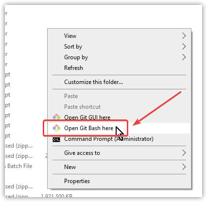
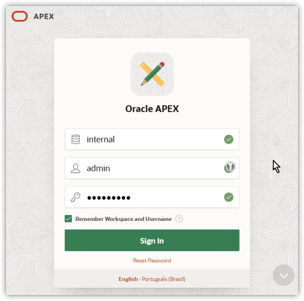

# Tutorial para instalação do Oracle Database XE 21c + APEX 23.1 + ORDS 23.3 + Tomcat 9 no Windows 10/11
Este roteiro descreve os passos necessários para instalar o banco de dados [**Oracle 21c Express Edition (XE)**](https://www.oracle.com/br/database/technologies/appdev/xe.html), juntamente com o [**Oracle Application Express (APEX)**](https://apex.oracle.com/pt-br/) versão **23.1** e o [**Oracle REST Data Services (ORDS)**](https://www.oracle.com/br/database/technologies/appdev/rest.html) versão **23.3** em computadores com sistema operacional Windows 10/11.

# A T E N Ç Ã O: ESTE ROTEIRO DEVE SER UTILIZADO APENAS EM AMBIENTES LOCAIS DE TESTES E DESENVOLVIMENTO E NÃO DEVE E NÃO PODE, DE NENHUMA FORMA, SER UTILIZADO EM AMBIENTES OFICIAIS DE PRODUÇÃO, MUITO MENOS EM AMBIENTES EXPOSTOS PUBLICAMENTE NA INTERNET.

## Passo 1 - Baixar e instalar o Git for Windows

Acessar o site [**https://gitforwindows.org**](https://gitforwindows.org/) , baixar e instalar o Git para Windows no computador local.<br/>
Durante a instalação do Git for Windows, deixar todas as opções com os valores padrão e apenas clicar no botão “Next” até o final.<br/>
Após concluída a instalação do Git for Windows, **O WINDOWS DEVE SER REINICIADO**.

## Passo 2 - Clonar ou baixar este repositório para o computador local com Windows

Clonar este repositório para qualquer diretório do computador local, com o comando abaixo no Prompt de Comando do Windows:
```powershell
git clone https://github.com/dmitsuo/tutorial-instalacao-oracle-db-apex-ords-windows.git

cd tutorial-instalacao-oracle-db-apex-ords-windows
```
## **Passo 3 - Baixar os pacotes de instalação**
Executar o script **`05-download-install-packages.sh`** com o interpretador Bash que foi instalado com o Git for Windows, bastando, para isso, **dar um duplo clique no arquivo por meio do Windows Explorer**.<br/>
Caso não seja possível executar esse script dessa forma, pode-se ainda, no Windows Explorer, clicar com o botão direito do mouse em qualquer área vazia do diretório que foi baixado do repositório, selecionar a opção "**Git Bash Here**" e em seguida fazer a chamada para esse script conforme indicado abaixo:<br/>

```bash
./05-download-install-packages.sh
```
Esse script fará automaticamente o download dos pacotes de software listados abaixo.<br/>
- **Oracle Database 21c Express Edition (XE) para Windows - Sistema Gerenciador de Banco de dados Relacional (SGBD) da Oracle**
    - Site para mais informações: [https://www.oracle.com/br/database/technologies/appdev/xe.html](https://www.oracle.com/br/database/technologies/appdev/xe.html)
- **Java JRE 17 - Eclipse Temurin - Ambiente de execução do Java (Java Runtime Environment - JRE) mantida pela Eclipse Foundation**
    - Site para mais informações: [https://adoptium.net/](https://adoptium.net/)
- **Oracle SQLcl - Ferramenta de linha de comando para execução de scripts e comandos SQL no banco de dados Oracle**
    - Site para mais informações: [https://www.oracle.com/br/database/sqldeveloper/technologies/sqlcl/](https://www.oracle.com/br/database/sqldeveloper/technologies/sqlcl/)
- **Oracle Application Express (APEX) 23.1 - Ferramenta Low Code para desenvolvimento de aplicações web corporativas e empresariais**
    - Site para mais informações: [https://apex.oracle.com/pt-br/](https://apex.oracle.com/pt-br/)
- **Oracle REST Data Services (ORDS) 23.3 - *Middleware* de serviços RESTful para bancos de dados Oracle, necessário para execução do Oracle APEX**
    - Site para mais informações: [https://www.oracle.com/br/database/technologies/appdev/rest.html](https://www.oracle.com/br/database/technologies/appdev/rest.html)
- **Apache Tomcat 9.0.82 - Servlet container utilizado para executar o ORDS**
    - Site para mais informações: [https://tomcat.apache.org/](https://tomcat.apache.org/)
## Passo 4 - Instalar o banco de dados Oracle no Windows
Executar o script **`10-oracle-db-install.sh`** para fazer a instalação do banco de dados Oracle 21c XE.<br/>
Durante a instalação, será preciso definir a senha de administrador do banco de dados (usuários **SYS** e **SYSTEM** do Oracle) a qual, posteriormente, precisará também ser informada na variável **`DB_SERVER_PWD`** do arquivo **`00-set-apex-ords-env.sh`**.<br/>
Essa instalação poderá demorar de 30 a 50 minutos, dependendo do desempenho do computador local e, após concluída, **O WINDOWS DEVE SER REINICIADO**.
## Passo 5 - Instalar o APEX 23.1
Executar o script **`15-apex-install.sh`** para fazer a instalação do Oracle Application Express (APEX) versão 23.1.
Essa instalação poderá demorar de 15 a 30 minutos, dependendo do desempenho do computador local.
## Passo 6 - Instalar o ORDS 23.3
Executar o script **`20-ords-install.sh`** para fazer a instalação do Oracle REST Data Services (ORDS) versão 23.3.
## Passo 7 - Ajustar parâmetros do ORDS 23.3 e Tomcat
Executar o script **`25-ords-tuning.sh`** para fazer ajustes nos parâmetros do ORDS 23.1.
## Passo 8 - Iniciar o Tomcat
Executar o script **`30-ords-tomcat-start.sh`** para inicializar o Tomcat que disponibilizará o acesso ao ORDS.<br/>
Para saber se o Tomcat inicializou com sucesso juntamente com o ORDS, deve haver no console as três mensagens indicadas abaixo:<br/>

## Passo 9 - Testar o acesso ao ORDS no navegador
Acessar no navegador a URL [**http://localhost:8080/ords**](http://localhost:8080/ords) para veriricar a correta execução dos passos acima.<br/>
Uma tela semelhante à imagem abaixo deve ser exibida.<br/>
A senha a ser utilizada na tela abaixo foi definida na variável de ambiente **`APEX_ADMIN_PWD`**, declarada no arquivo **`00-set-apex-ords-env.sh`**<br/>
